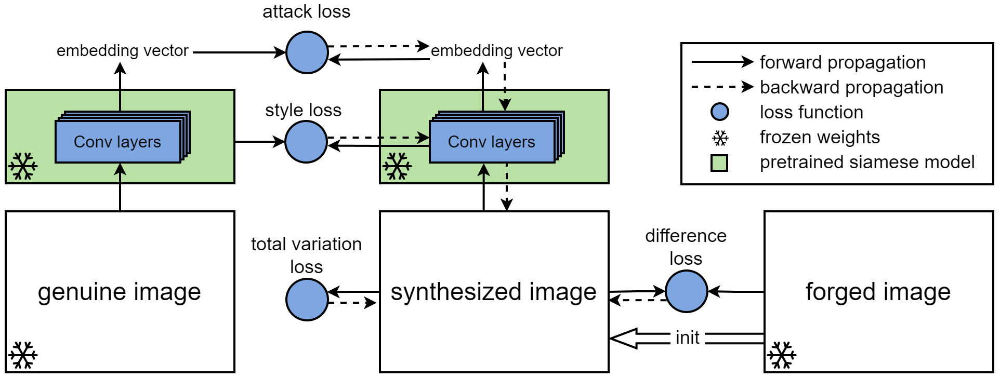

# A White-Box False Positive Adversarial Attack Method on Contrastive Loss Based Offline Handwritten Signature Verification Models
This repository is for the paper in **the 27th International Conference on Artificial Intelligence and Statistics (AISTATS 2024)**.

## Environment
```
torch==2.0.1
pandas==2.0.3
pillow==10.0.0
torchvision==0.15.2
argparse==1.4.0
tqdm==4.66.1
python-pushover==0.4
matplotlib==3.7.2
numpy==1.25.2
```
`python-pushover` is optional, which is a real-time notifications on mobile phone.
## Citing
```latex
@InProceedings{guo2024white,
  title={A White-Box False Positive Adversarial Attack Method on Contrastive Loss Based Offline Handwritten Signature Verification Models},
  author={Guo, Zhongliang and Li, Weiye and Qian, Yifei and Arandjelovic, Ognjen and Fang, Lei},
  booktitle={Proceedings of The 27th International Conference on Artificial Intelligence and Statistics},
  pages={901--909},
  year={2024},
  volume={238},
  month={02--04 May},
  publisher={PMLR},
}

```
